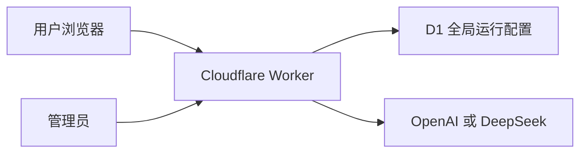
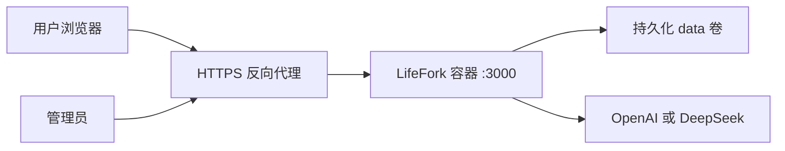

# LifeFork V0.8 Public Beta 部署与运维手册

> 文档状态：生产运行基线
> 版本：Deployment Runbook v1.0
> 更新日期：2026-07-31
> 目标环境：Sites / Cloudflare Worker，或单实例 Linux VPS + Docker Compose + HTTPS 反向代理

## 1. 目标架构

### 1.1 Sites / Cloudflare



个人 Self Skill、聊天记录和导入摘要仍位于用户浏览器。D1 只保存全局运营配置。AI key、会话密钥和管理密码由 Sites 环境变量管理。

### 1.2 单实例 Docker



Public Beta 可以使用 Sites 单 Worker 部署或单实例 Docker。D1 已解决 Cloudflare 环境中的运行配置持久化；会话限流仍为进程或 Worker isolate 内存状态，扩大流量前需要迁移到共享限流服务。

## 2. 服务器要求

最低配置：

- Linux x86_64 或 arm64。
- 2 vCPU。
- 2 GB RAM。
- 20 GB SSD。
- Docker Engine 26 或更新版本。
- Docker Compose v2。
- 可用域名和 HTTPS。

推荐配置：

- 2 至 4 vCPU。
- 4 GB RAM。
- 40 GB SSD。
- 独立日志和告警服务。

## 3. 首次部署

### 3.1 Sites / Cloudflare

发布前执行：

```bash
npm ci
npm run check
npm audit --omit=dev
npm run build
npm run build:cloudflare
```

托管环境必须设置：

```dotenv
LIFEFORK_VERSION=0.8.2
LIFEFORK_AI_ENABLED=true
LIFEFORK_AI_PROVIDER=openai
LIFEFORK_COOKIE_SECURE=true
LIFEFORK_SESSION_SECRET=<至少 32 字节随机值>
LIFEFORK_ADMIN_PASSWORD=<密码管理器生成的强密码>
OPENAI_API_KEY=<服务器 API key>
OPENAI_MODEL=gpt-5.6-terra
```

选择 DeepSeek 时改用对应 provider、key 和 model。`.openai/hosting.json` 中 `d1` 必须保持为 `DB`，迁移文件位于 `drizzle/`。

部署后验证：

1. `/api/health` 返回 `status: ok` 和 `version: 0.8.2`。
2. `/admin` 登录成功。
3. 修改公告并保存，刷新后仍存在。
4. 生成或聊天响应元数据包含实际 provider 和 model。
5. 关闭 AI 后响应进入本地降级并给出 `fallbackReason`。

### 3.2 Docker：获取代码

```bash
git clone https://github.com/yoyo-wu98/lifefork.git
cd lifefork
git checkout <release-branch-or-tag>
```

### 3.3 Docker：创建环境文件

```bash
cp .env.example .env
```

必须设置：

```dotenv
LIFEFORK_AI_ENABLED=true
LIFEFORK_AI_PROVIDER=openai
LIFEFORK_COOKIE_SECURE=true
LIFEFORK_SESSION_SECRET=<至少 32 字节随机值>
LIFEFORK_ADMIN_PASSWORD=<密码管理器生成的强密码>
OPENAI_API_KEY=<服务器 API key>
OPENAI_MODEL=gpt-5.6-terra
```

使用 DeepSeek 时：

```dotenv
LIFEFORK_AI_PROVIDER=deepseek
DEEPSEEK_API_KEY=<服务器 API key>
DEEPSEEK_MODEL=deepseek-chat
```

禁止：

- 将 `.env` 提交到 Git。
- 将密钥写入 `NEXT_PUBLIC_*`。
- 在 PR、Issue、日志或截图中展示密钥。
- 在公开环境使用示例会话密钥。

### 3.4 Docker：启动

```bash
docker compose build
docker compose up -d
docker compose ps
```

健康检查：

```bash
curl -fsS http://127.0.0.1:3005/api/health
```

预期：

- HTTP 200。
- `status` 为 `ok` 或清楚的维护状态。
- `aiConfigured` 与实际环境一致。
- 不返回任何密钥。

## 4. HTTPS 反向代理

### 4.1 Nginx 示例

```nginx
server {
    listen 443 ssl http2;
    server_name lifefork.example.com;

    ssl_certificate /etc/letsencrypt/live/lifefork.example.com/fullchain.pem;
    ssl_certificate_key /etc/letsencrypt/live/lifefork.example.com/privkey.pem;

    client_max_body_size 6m;

    location / {
        proxy_pass http://127.0.0.1:3005;
        proxy_http_version 1.1;
        proxy_set_header Host $host;
        proxy_set_header X-Forwarded-Proto $scheme;
        proxy_set_header X-Forwarded-For $proxy_add_x_forwarded_for;
        proxy_read_timeout 90s;
    }
}
```

### 4.2 TLS 验收

- HTTP 自动跳转 HTTPS。
- HSTS 由反向代理在确认全站 HTTPS 后启用。
- `lifefork_session` 和管理员 Cookie 带 `Secure`。
- `/admin` 不被搜索引擎索引。
- 管理入口可增加 IP allowlist。

## 5. 运行配置

管理员访问：

```text
https://lifefork.example.com/admin
```

可修改：

- 服务在线或维护。
- AI 功能。
- 微信导入。
- 传统文化方法。
- 演示数据。
- 默认分析预设。
- 测试版标签。
- 公告。
- 隐私提示。

Docker 配置保存于：

```text
/app/data/runtime-config.json
```

宿主机对应：

```text
./data/runtime-config.json
```

Sites / Cloudflare 配置保存于 D1：

```text
DB.lifefork_runtime_config
```

## 6. 发布流程

### 6.1 发布前

```bash
npm ci
npm run check
npm audit --omit=dev
npm run build
npm run build:cloudflare
docker compose config
docker compose build
```

检查：

- `.env` 未被 Git 跟踪。
- 生产依赖无已知漏洞。
- 管理密码和会话密钥已轮换。
- 默认方法和功能开关符合发布计划。
- 隐私说明与实际 AI 提供商一致。
- 浏览器桌面和移动冒烟通过。

### 6.2 发布

```bash
git fetch --all --prune
git checkout <release-tag-or-branch>
docker compose build --pull
docker compose up -d
docker compose ps
curl -fsS http://127.0.0.1:3005/api/health
```

### 6.3 发布后

检查：

1. 首页。
2. 五问与生成。
3. AI 提供商记录。
4. 本地降级。
5. 人生地图。
6. 分支对话。
7. 管理登录。
8. 配置保存。
9. 维护模式。
10. 日志无密钥和用户原文。

## 7. 回滚

保留最近两个可用镜像标签。

回滚步骤：

```bash
docker compose down
git checkout <last-known-good-tag>
docker compose build
docker compose up -d
curl -fsS http://127.0.0.1:3005/api/health
```

紧急情况下先进入维护模式，再执行回滚。

运行配置回滚：

```bash
cp backups/runtime-config.<timestamp>.json data/runtime-config.json
docker compose restart lifefork
```

## 8. 备份与恢复

当前服务端持久化内容只有全局运行配置。

每日备份：

```bash
install -d -m 700 backups
cp data/runtime-config.json "backups/runtime-config.$(date +%Y%m%d-%H%M%S).json"
```

保留策略：

- 每日备份 14 天。
- 每周备份 8 周。
- 每月备份 12 个月。

个人 Self Skill 存在用户浏览器，服务器备份不会包含个人结果。

## 9. 监控

### 9.1 最小指标

- 请求总量。
- 2xx、4xx、5xx 比例。
- AI 请求成功率。
- AI 请求 P50、P95 延迟。
- AI 降级次数。
- 429 次数。
- 容器 RSS。
- 容器重启次数。
- 健康检查状态。
- 单次 AI token 和成本。

### 9.2 日志允许字段

- 时间。
- 请求 ID。
- 路由。
- 状态码。
- 耗时。
- AI 提供商。
- 模型名。
- 是否降级。
- 错误类型。

日志禁止字段：

- API key。
- 管理密码。
- Cookie。
- 五问原文。
- 微信原文。
- 出生日期和时刻。
- 聊天正文。

## 10. 容量与成本控制

当前默认限流：

| 能力 | 限额 |
| --- | --- |
| Self Skill AI 生成 | 6 次/10 分钟/会话 |
| 分支聊天 | 40 次/10 分钟/会话 |
| 微信 AI 分析 | 4 次/10 分钟/会话 |
| 管理登录 | 5 次/15 分钟 |

上线第一周建议：

- 邀请制或小流量入口。
- 每日检查 AI 成本。
- 为 AI 账户设置硬预算。
- P95 超过 30 秒时降低推理强度或切换模型。
- 错误率超过 5% 时关闭 AI，保留本地功能。

## 11. 故障处理

### 11.1 AI 提供商不可用

1. 后台关闭 AI。
2. 确认本地主流程可用。
3. 检查提供商状态和账户额度。
4. 检查超时、模型名和 base URL。
5. 修复后先在受控会话开启。

### 11.2 内存持续升高

1. 后台关闭微信 AI 和演示入口。
2. 查看 `docker stats`.
3. 检查容器是否接近 1 GB。
4. 采样地图操作前后 RSS。
5. 检查请求并发和超时调用。
6. 必要时进入维护模式并重启。
7. 保留日志和版本号用于复现。

### 11.3 地图不可用

1. 保留报告和时间线功能。
2. 后台公告说明临时限制。
3. 回滚至最近可用镜像。
4. 使用固定场景数据复现。
5. 验证父子包含、可见性和相机三个模块。

### 11.4 管理后台无法登录

1. 确认环境变量存在。
2. 确认 HTTPS 和 Cookie secure 配置。
3. 检查反向代理 Host 与 `X-Forwarded-Proto`。
4. 必要时轮换管理员密码并重启容器。

## 12. 多实例升级条件

增加第二个应用实例前完成：

1. 限流迁移到 Redis。
2. 运行配置迁移到共享数据库或配置中心。
3. 管理认证迁移到统一身份服务。
4. 会话密钥在所有实例一致。
5. AI 成本和并发在网关层控制。
6. 日志统一收集。
7. 健康检查接入负载均衡器。

## 13. 发布签字

| 角色 | 必须确认 |
| --- | --- |
| Product | 范围、文案、默认方法 |
| Frontend | 核心流程、地图、响应式 |
| AI | 模型、提示词、降级、成本 |
| Safety & Privacy | 隐私、同意、危机和文化边界 |
| QA | 门禁命令和冒烟证据 |
| Ops | HTTPS、密钥、备份、告警和回滚 |

所有角色确认后，版本才能从 Release Candidate 标记为 Public Beta。
