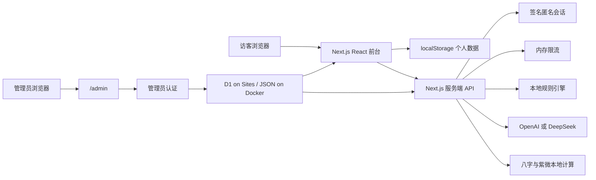

# LifeFork V0.8 Public Beta 技术审计与重构报告

> 文档状态：发布候选基线
> 报告版本：Technical Review v1.0
> 更新日期：2026-07-31
> 审计范围：前台体验、人生地图、Self Skill、分析方法、AI 网关、数据导入、后台运营、安全、性能、部署和文档

## 1. 执行摘要

LifeFork 已从单浏览器原型升级为可供多人同时访问的公开测试应用。当前实现采用匿名签名会话、服务端 AI 调用、浏览器本地个人存储、服务端全局运行配置和本地规则降级。用户无需注册，也无需提供 API key。

本轮重构解决了以下发布阻塞项：

1. AI 密钥只存在于服务器环境变量中。
2. 每位访客获得独立签名会话和限流桶。
3. AI、微信摘要、传统文化方法和演示入口可由管理员统一开关。
4. 每条主要分析和人生分支显示方法、权重、参考度、假设与未知因素。
5. 八字与紫微斗数仅在用户主动启用并明确同意后计算。
6. MBTI 以人生阶段倾向呈现，用户可以修改或拒绝。
7. 人生地图拆为稳定场景、可见性、相机、节点和连线模块。
8. 大文本导入、可见节点、连线、运行内存和容器资源均设置上限。
9. 管理后台迁移到独立 `/admin` 路由，并使用服务端认证。
10. Docker 运行加入健康检查、资源限制、非 root 用户和持久化配置目录。

当前版本适合受控 Public Beta。公开域名发布前仍需完成 HTTPS、真实生产密钥、外部限流存储、日志与告警接入。

## 2. 审计结论

| 领域 | 结论 | 发布状态 | 说明 |
| --- | --- | --- | --- |
| 核心流程 | 五问到报告、时间线、地图、对话、分享闭环 | 可发布候选 | AI 失败可回退本地生成 |
| 多人访问 | 匿名签名会话隔离请求额度 | 可小规模公测 | 多实例部署前需 Redis 限流 |
| AI 安全 | 服务端密钥、请求超时、结构校验、降级 | 可小规模公测 | 需补充供应商数据处理协议 |
| 方法透明 | 七类方法、权重、参考度和来源 | 已实现 | 文化方法明确低参考度 |
| 人生地图 | 稳定拓扑、语义缩放、父子包含 | 重点回归区 | 每次地图改动必须执行视觉回归 |
| 微信导入 | 用户主动粘贴或上传，本地先摘要 | 可公测 | 不读取微信数据库 |
| 语气学习 | 当前与阶段语气画像、用户校准 | 基础可用 | 尚未形成跨会话版本学习 |
| 后台运营 | 维护模式、功能开关、前台通知 | 可单实例使用 | 多实例需共享配置服务 |
| 隐私 | 个人结果默认保存在浏览器 | 基础可用 | 清除浏览器数据会丢失结果 |
| 性能 | 节点、输入、内存、容器资源有上限 | 可发布候选 | 仍需线上真实流量观测 |
| 可访问性 | 基础键盘、焦点和 reduced motion | 部分完成 | 需要独立 WCAG 2.2 AA 审计 |
| 自动化测试 | 静态检查和场景数据校验 | 部分完成 | 缺少 Playwright E2E 和单元测试套件 |

## 3. 当前系统边界

### 3.1 Public Beta 提供

- 匿名访问。
- 五问访谈。
- 可选微信文本本地摘要。
- 可选补充文字。
- 分析方法选择与权重配置。
- Self Skill 综合报告。
- 可编辑时间线。
- 多时间尺度人生地图。
- 分支来源说明。
- 阶段自我对话。
- 分享文本与 JSON 导出。
- 本地数据清除。
- 全局管理员控制台。

### 3.2 Public Beta 暂不提供

- 用户账号和跨设备同步。
- 云端个人档案库。
- 自动连接微信本地数据库。
- 官方 MBTI 测评。
- 个人成功概率。
- 医疗、心理、法律和财务诊断。
- 确定性未来预测。
- 多管理员 RBAC。
- 审批流和内容版本发布。

## 4. 运行架构



### 4.1 客户端

职责：

- 收集用户主动输入。
- 执行本地微信摘要。
- 管理步骤和当前选择。
- 保存个人 Self Skill、聊天和地图状态。
- 展示方法来源、限制和运行提供商。
- 在 API 不可用时继续本地流程。

客户端禁止：

- 保存服务器 AI 密钥。
- 自动读取第三方应用数据库。
- 将出生信息写入公开分享卡片。
- 默认上传完整微信原文。

### 4.2 服务端

职责：

- 签发匿名会话。
- 按会话限流。
- 读取全局运行配置。
- 调用 AI 提供商。
- 校验 AI JSON 结构。
- 执行文化方法本地计算。
- 返回实际提供商、模型和降级原因。
- 管理后台认证和配置写入。

### 4.3 持久化

| 数据 | 当前位置 | 生命周期 | Public Beta 限制 |
| --- | --- | --- | --- |
| Self Skill | 浏览器 localStorage | 用户主动清除前 | 不跨设备 |
| 五问与补充文本 | 浏览器 localStorage | 用户主动清除前 | 同一浏览器可见 |
| 聊天消息 | 浏览器 localStorage | 用户主动清除前 | 受浏览器容量限制 |
| 微信原始文本 | 组件内存 | 当前页面会话 | 不持久化 |
| 微信摘要 | 浏览器 localStorage | 用户主动清除前 | 只保留有界摘要 |
| 全局运行配置 | 服务端 JSON 文件 | 运维清除或覆盖前 | 单实例或共享卷 |
| API key | 服务器环境变量 | 运维控制 | 不进入浏览器 |
| 匿名会话 | HttpOnly 签名 Cookie | 30 天 | 不包含个人资料 |
| 限流计数 | 服务端进程内存 | 进程生命周期 | 多实例不共享 |

## 5. 模块审计

### 5.1 应用编排

主要文件：

- `src/app/page.tsx`
- `src/components/AppNav.tsx`
- `src/components/RuntimeConfigSync.tsx`
- `src/lib/stores/lifeforkStore.ts`
- `src/lib/stores/slices/*`

结论：

- 页面已经降为步骤编排层。
- 输入、生成、地图、聊天和 UI 状态已拆为 slices。
- 运行配置通过单独组件同步。
- 旧存档需要持续执行 schema 修复和步骤依赖校验。

下一步：

- 为状态迁移建立版本化单元测试。
- 将步骤依赖声明从条件分支升级为显式状态机表。
- 记录 localStorage 配额和写入失败。

### 5.2 Self Skill 与分析整合

主要文件：

- `src/lib/selfSkill/*`
- `src/lib/analysis/methodRegistry.ts`
- `src/lib/analysis/integratedAnalysis.ts`
- `src/lib/selfSkillEngine.ts`

结论：

- 本地生成器已经模块化为画像、证据、时间、动态性格和分支规则。
- 分析权重在启用方法之间归一化。
- 主要判断保留方法贡献和证据引用。
- AI 输出无法覆盖本地安全边界与文化方法分类。

下一步：

- 为每个规则模块补充 fixture 单元测试。
- 加入用户对 insight 的确认、修改和拒绝状态。
- 将群体统计从通用说明升级为带样本范围的数据源注册表。

### 5.3 AI 网关

主要文件：

- `src/lib/ai/client.ts`
- `src/lib/ai/prompts/*`
- `src/lib/ai/schemas/*`
- `src/app/api/generate-self-skill/route.ts`
- `src/app/api/chat/route.ts`
- `src/app/api/wechat-analyze/route.ts`

结论：

- 支持 OpenAI Responses API 和 DeepSeek。
- OpenAI 请求设置 `store: false`。
- 每次调用设置超时。
- 请求和响应经过长度限制与 schema 校验。
- 提供商失败时使用本地结果，并记录降级原因。
- 生产日志不输出用户原文或密钥。

残余风险：

- 当前限流基于进程内存，重启后清空。
- 未建立统一调用成本账本。
- 未建立提示词版本效果回归集。
- DeepSeek 数据处理条款需要部署方单独确认。

### 5.4 文化方法

主要文件：

- `src/lib/analysis/culturalCalculators.server.ts`
- `src/components/AnalysisMethodStep.tsx`

结论：

- 八字使用 `lunar-typescript` 计算四柱。
- 紫微斗数使用 `iztro` 计算命盘信息。
- 计算发生在 LifeFork 服务器。
- 用户必须主动启用方法、补全必要信息并同意处理。
- 出生信息不发送给 AI 提供商。
- 输出固定归类为传统文化解读，参考度低于现实证据和行为模式。

残余风险：

- 出生时刻误差会影响排盘。
- 不同流派存在规则差异。
- 需要在界面持续避免把文化解释显示为事实。

### 5.5 阶段 MBTI

主要文件：

- `src/lib/selfSkill/dynamicTypeRules.ts`
- `src/components/SelfSkillPanel.tsx`

结论：

- 当前实现按阶段生成倾向。
- 报告展示参考度和变化原因。
- 文案允许用户不同意。
- 当前结果来自规则与 AI 情景分析，不属于官方量表。

残余风险：

- 输入样本较少时类型波动较大。
- 需要增加四维连续分数，减少四字母标签的主导地位。

### 5.6 微信数据导入

主要文件：

- `src/components/WeChatImportStep.tsx`
- `src/lib/wechatEngine.ts`
- `src/app/api/wechat-analyze/route.ts`

结论：

- 文件限制为 5 MB。
- 解析行数、源字符和分析文本都有上限。
- 原始文本先在浏览器解析。
- 主流程使用摘要，默认不持久化原文。
- 服务端 AI 深度分析受独立开关和限流控制。

残余风险：

- 大文本解析仍在主线程。
- 第三方聊天内容需要更明确的授权提示。
- 需要增加人名和联系方式本地脱敏预览。

### 5.7 人生地图

主要文件：

- `src/components/ForkPaths/LifeMapCanvas.tsx`
- `src/components/ForkPaths/LifeMapNode.tsx`
- `src/components/ForkPaths/LifeMapLinks.tsx`
- `src/components/ForkPaths/model/stableScene.ts`
- `src/components/ForkPaths/model/visibility.ts`
- `src/components/ForkPaths/model/camera.ts`

结构约束：

1. 同一 `ForkPath` 只有一个场景实体。
2. 父节点的时间范围必须包含子节点。
3. 展开父容器时，直接子节点必须位于容器内部。
4. 当前尺度节点可读。
5. 上层祖先以低透明虚线容器显示。
6. 更深后代按语义尺度逐级披露。
7. 普通连接线从父节点右侧连接子节点左侧。
8. 展开父容器到内部子节点的线从容器内部左侧开始。
9. 焦点关系之外的连线降低透明度。
10. 镜头聚焦必须包含目标可见节点，不能停在空白区域。

性能约束：

- 默认可见节点不超过 24。
- 默认可见连线不超过 28。
- 指针移动只更新相机或拖拽状态。
- 相机更新通过 `requestAnimationFrame` 合并。
- 禁止 SVG 模糊滤镜和全画布 backdrop blur。
- 所有定时器、监听器和 observer 在卸载时清理。

残余风险：

- 地图是当前最高风险模块。
- 缺少自动截图差异阈值。
- 缺少触控真机回归。
- 节点数量超过当前预算时需要虚拟化或 Canvas/WebGL 方案。

### 5.8 对话与语气

主要文件：

- `src/lib/voiceEngine.ts`
- `src/lib/dialogueEngine.ts`
- `src/components/InstanceChat.tsx`

结论：

- 当前语气画像包括句长、措辞、直接程度和情绪基调。
- 不同人生阶段可使用不同语气。
- 用户可以通过后续对话校准。
- AI 不可用时继续使用本地模板。

下一步：

- 增加语气版本号。
- 保存用户确认和拒绝的表达特征。
- 为不同阶段建立独立证据样本。
- 增加相似度、过度模仿和敏感表达测试。

### 5.9 后台运营

主要文件：

- `src/app/admin/page.tsx`
- `src/app/api/admin/session/route.ts`
- `src/app/api/admin/config/route.ts`
- `src/lib/server/adminAuth.ts`
- `src/lib/server/runtimeConfigStore.ts`

结论：

- 管理入口独立于公开导航。
- 管理密码只在服务端环境变量中。
- Cookie 使用 HttpOnly、SameSite Strict 和签名校验。
- 配置写入使用临时文件和原子重命名。
- 管理员可控制维护模式、功能开关、默认方法和前台提示。

残余风险：

- 当前只有单密码角色。
- 无审计日志。
- 多实例需要共享配置存储。
- 配置修改需要 CSRF 和来源校验持续回归。

## 6. API 合约

| 路由 | 方法 | 主要输入 | 主要输出 | 限流 |
| --- | --- | --- | --- | --- |
| `/api/public-config` | GET | 无 | 公开运行配置 | 无 |
| `/api/health` | GET | 无 | 健康状态和服务能力 | 无 |
| `/api/generate-self-skill` | POST | 五问、摘要、方法设置 | AI 核心、文化结果、执行元数据 | 6 次/10 分钟/会话 |
| `/api/chat` | POST | 消息、Self Skill 摘要、分支 | 模拟回复、执行元数据 | 40 次/10 分钟/会话 |
| `/api/wechat-analyze` | POST | 有界聊天摘要 | 深度摘要、执行元数据 | 4 次/10 分钟/会话 |
| `/api/admin/session` | POST/DELETE | 管理密码或退出 | 认证状态 | 登录 5 次/15 分钟 |
| `/api/admin/config` | GET/PUT | 全局配置 | 当前配置 | 管理员认证 |

所有公开写接口要求：

- `Cache-Control: no-store`
- 有界 JSON 请求体
- 会话 Cookie
- 限流响应头
- 维护模式检查
- 功能开关检查
- 安全输入检查
- 结构化错误

## 7. 安全与隐私审计

### 7.1 已实现控制

- API key 仅服务端可读。
- `.env.local` 和运行配置不进入 Git。
- 匿名会话 Cookie 签名。
- 管理 Cookie 与公开会话分离。
- 管理修改检查同源请求。
- API 输入长度限制。
- 危机关键词切换现实支持提示。
- AI 输出 schema 校验。
- 分享卡片不包含原始聊天和出生信息。
- 安全响应头与 CSP。
- Docker 非 root 用户。
- Docker `no-new-privileges`。
- 生产依赖漏洞审计门禁。

### 7.2 公开发布前必须完成

1. 使用密码管理器生成会话密钥和管理员密码。
2. 启用 HTTPS，并设置 `LIFEFORK_COOKIE_SECURE=true`。
3. 轮换所有曾出现在终端、聊天或提交历史中的 token。
4. 确认 AI 提供商数据保留和地域政策。
5. 在隐私政策中列出发送给 AI 的字段。
6. 加入请求 ID、错误率和成本告警。
7. 将限流迁移到 Redis 或网关。
8. 给管理员入口增加 IP allowlist 或身份提供商。
9. 建立数据泄露和危机内容事件处理流程。

## 8. 性能与资源审计

### 8.1 已修正的高内存来源

历史上开发服务器、文件 watcher、地图全树同时渲染、持续动画、未清理监听器和大文本一次性处理会共同放大内存占用。

当前缓解：

- 演示使用生产构建。
- Next standalone 启动。
- Docker Node 堆上限 768 MB。
- 容器总内存 1 GB。
- 地图限制可见节点和连线。
- 相机写入按帧合并。
- 微信输入和行数截断。
- 定时器、observer 和事件监听器清理。
- 禁用高成本模糊滤镜。

### 8.2 预算

| 指标 | Public Beta 目标 |
| --- | ---: |
| 首屏可交互 | 本地 2 秒内 |
| 本地 Self Skill 生成 | 300 ms 内 |
| 服务器 AI 生成 | P95 30 秒内 |
| 地图首次可交互 | 700 ms 内 |
| 默认可见节点 | 24 以内 |
| 默认可见连线 | 28 以内 |
| 微信文件 | 5 MB 以内 |
| 单次分析文本 | 120,000 字符以内 |
| 容器内存 | 1 GB 上限 |
| Node 堆 | 768 MB 上限 |

### 8.3 2026-07-31 本地生产验收

运行环境：Next.js standalone，Node.js 生产模式，固定端口 `3005`。

| 项目 | 结果 |
| --- | --- |
| 监听进程 | 仅 `3005` 一个 Node 进程 |
| 新启动空闲 RSS | 约 43 MB |
| 500 次请求、20 并发 | 0 失败，约 1,406 req/s |
| 第一轮压测后 RSS | 约 118 MB |
| 2,000 次请求、50 并发 | 0 失败，约 2,167 req/s |
| 第二轮压测完成后 RSS | 回落到约 42 MB |
| 会话限流 | 第 41 次请求开始返回 `429` |
| 生产构建 | 通过，2 个 build workers |
| `npm audit --omit=dev` | 0 个已知漏洞 |
| Compose 配置 | 使用测试环境变量校验通过 |
| Docker 镜像构建 | Docker Hub 基础镜像请求超时，未完成远端拉取验收 |

### 8.4 Cloudflare Worker 验收

运行环境：OpenNext `1.20.2`、Wrangler `4.116.0`、本地 workerd、D1 绑定。

| 项目 | 结果 |
| --- | --- |
| OpenNext 转换 | 通过，生成 `.open-next/worker.js` |
| Sites 部署包 | 生成 `dist/server/index.js` 与静态资源 |
| 首页与 API Route | HTTP 200 |
| 安全响应头 | CSP、frame deny、referrer policy、permissions policy 生效 |
| D1 管理配置 | 修改、保存、刷新恢复通过 |
| 服务器 AI | DeepSeek `deepseek-chat` 实际调用通过 |
| AI 响应元数据 | provider、model、token budget、usage 可见 |
| 管理认证 | 签名 Cookie 在 Worker 运行时生效 |

浏览器实机路径已经覆盖：

- 五问、补充文本和微信摘要导入。
- DeepSeek 服务器生成与本地规则降级元数据。
- 证据优先和综合分析权重。
- 八字、紫微斗数服务端计算及文化方法免责声明。
- 阶段性 MBTI 和阶段语气。
- 地图父子包含、尺度展开、三种聚焦、连线高亮、滚轮缩放和稳定平移。
- 未来实例对话、语气反馈和危机输入拦截。
- 结果卡片、刷新恢复和后台配置保存。
- `390 x 844` 手机报告和地图；页面宽度无横向溢出，当前问题居中。

## 9. 可用性审计

### 9.1 已改善

- 首页说明改为“输入什么、得到什么、需要多久、数据放哪里”。
- 核心按钮使用直接动作名称。
- 分析报告先显示结论，再显示依据和限制。
- 每个分支显示收益、成本、假设和未知因素。
- 传统文化方法由用户主动选择。
- 当前尺度的人生地图文字保持可读。
- 失效步骤提供返回入口。
- 管理后台不占用公开导航。

### 9.2 仍需真实用户或线上验证

- 10 名首次用户能否独立完成流程。
- 方法权重是否容易理解。
- 用户是否能区分“参考度”和“概率”。
- 危机提示是否清楚且不造成二次压力。
- 真实 iPhone、Android 和不同触控板的手势差异。
- 线上网络延迟、AI 成本和第三方提供商限流。
- 自动化 E2E 和视觉回归尚未覆盖全部地图场景。

## 10. 质量门禁

每个发布候选必须执行：

```bash
npm ci
npm run check
npm audit --omit=dev
npm run build
docker compose config
```

人工冒烟路径：

1. 五问全流程。
2. 跳过微信路径。
3. 导入微信摘要路径。
4. 证据优先方法。
5. 文化方法启用与拒绝。
6. AI 成功路径。
7. AI 关闭和失败降级路径。
8. 时间线编辑。
9. 人生地图缩放、拖拽、焦点和父子包含。
10. 分支对话与危机输入。
11. 分享和 JSON 导出。
12. 刷新恢复和清空数据。
13. 管理登录、配置保存和维护模式。
14. 桌面与移动端截图。
15. 空闲和地图交互后的内存采样。

## 11. 发布建议

当前支持 Sites / Cloudflare 与单实例 Docker 两种 Public Beta 部署：

Sites / Cloudflare：

- OpenNext Worker。
- D1 持久化全局配置。
- Sites 环境变量管理 AI key 和管理凭据。
- 适合快速公开测试和弹性访问。

单实例 Docker：

- 1 个 LifeFork 容器。
- 1 个反向代理。
- HTTPS。
- 持久化 `data/` 卷。
- 服务器环境变量管理 AI key 和管理凭据。
- 日志只记录请求状态、耗时、提供商和错误类型。
- 每日备份运行配置。

达到以下条件后再扩大公开流量或运行多个自管实例：

- 限流迁移 Redis。
- 运行配置迁移共享数据库或配置服务。
- 管理认证迁移身份提供商。
- 日志、指标和追踪统一。
- 个人账户和云存储完成单独隐私评审。

## 12. 最终判断

LifeFork V0.8 已具备受控 Public Beta 的产品和工程基础。服务器 AI、方法来源、文化计算、匿名会话和管理后台已经形成完整链路。人生地图的当前交互已通过人工实机验收，后续回归风险需要通过自动化场景和视觉基线继续控制。其余发布风险集中在线上可观测性、共享限流、正式隐私政策和自动化 E2E。

发布顺序应保持为：Node 与 Worker 双构建验证、浏览器全流程验收、受控生产部署、受邀用户测试、指标复盘、再扩大流量。
